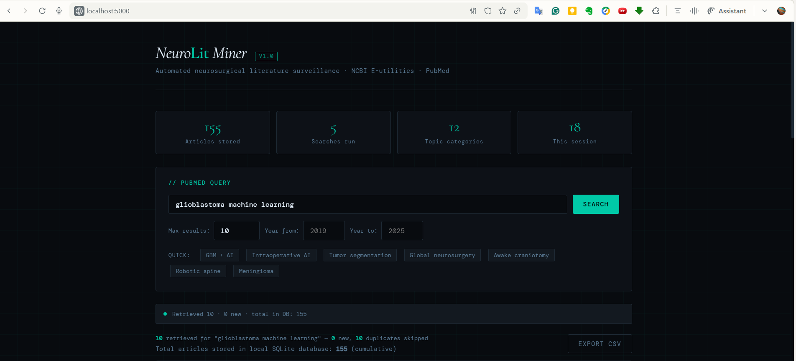

# NeuroLit Miner



**Automated neurosurgical literature surveillance via PubMed E-utilities**

---

## Clinical Problem Statement

The neurosurgical literature is expanding faster than any individual clinician can manually track. Evidence synthesis, systematic review preparation, and topic surveillance require repeated searching, deduplication, classification, and export.

NeuroLit Miner automates the early surveillance workflow. It queries PubMed programmatically through the NCBI E-utilities API, retrieves structured article metadata, classifies records by topic, and stores them in a local SQLite database for downstream review, analysis, or research tracking.

---

## What It Does

- Queries PubMed with neurosurgery keywords or topic combinations
- Retrieves article metadata: title, authors, journal, year, abstract, PMID, DOI, URL
- Extracts MeSH terms when available in PubMed XML
- Applies lightweight topic tags for quick filtering
- Stores records in a local SQLite database
- Deduplicates stored PubMed articles by PMID
- Searches stored records by topic, keyword, and year
- Exports article results to CSV
- Provides a local Flask web UI for PubMed search, database search, analytics, and ClinicalTrials.gov lookup

---

## CLI Usage

Install dependencies:

```bash
pip install -r requirements.txt
```

Run a PubMed search:

```bash
python src/main.py --query "glioblastoma machine learning" --max 50
```

Search with a year filter:

```bash
python src/main.py --query "AI neurosurgery" --max 100 --year_from 2020
```

Search the local SQLite database:

```bash
python src/main.py --search_db --topic AI_ML --year_from 2021
```

Export results to CSV:

```bash
python src/main.py --query "global neurosurgery workforce" --max 30 --export
```

Show database statistics:

```bash
python src/main.py --stats
```

---

## Flask UI Usage

Run the local Flask app:

```bash
pip install -r requirements.txt
python src/app.py
```

Then open:

```text
http://localhost:5000
```

You can also launch the app from the project root:

```bash
python run_app.py
```

---

## Workflow Notes

- The web UI must be opened through Flask at `http://localhost:5000`; do not open `templates/index.html` directly as a `file://` page.
- The SQLite database at `data/neurolit.db` is the source of truth for stored articles and trials.
- PubMed searches append to the database. Existing articles remain stored unless the database file is removed.
- PubMed article deduplication is based on PMID.
- CSV files in `results/` are snapshots generated at export time. They do not update automatically after later searches.
- MeSH terms may be missing for very recent articles because NLM indexing can lag publication.

---

## Limitations

- Topic tagging is keyword-based and approximate; it is intended as a navigation aid, not a validated classifier.
- The tool depends on external PubMed and ClinicalTrials.gov API availability.
- It is designed for local research workflow support, not production deployment.
- It does not replace full systematic review screening, risk-of-bias assessment, or clinical judgment.
- The Flask server uses development defaults and should not be exposed publicly without hardening.

---

## Roadmap

| Version | Features |
| --- | --- |
| V1 | PubMed search, SQLite storage, CSV export, topic tagging |
| V1.5 | ClinicalTrials.gov module, MeSH extraction, web UI analytics |
| V2 | Duplicate review workflow, batch queries, abstract keyword frequency |
| V3 | AI summarization layer, evidence grading scaffold |

---

## Author

**Assia Moumen** - M.D., MEng

Pre-residency researcher building computational tools for neurosurgical evidence synthesis and global neurosurgery intelligence.

---

## Citation / Academic Use

If this tool contributes to a systematic review or meta-analysis, cite as:

```text
[Author]. NeuroLit Miner: Automated neurosurgical literature surveillance tool.
GitHub, 2025. https://github.com/[username]/neurolit-miner
```

