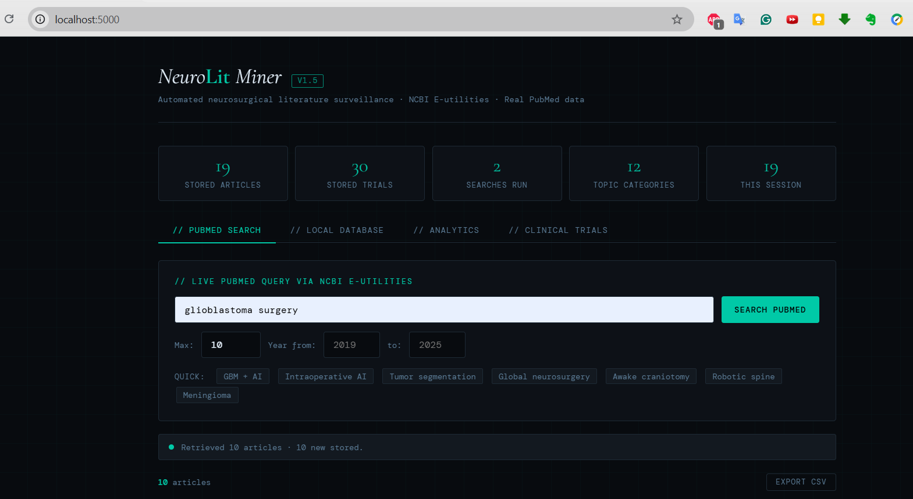
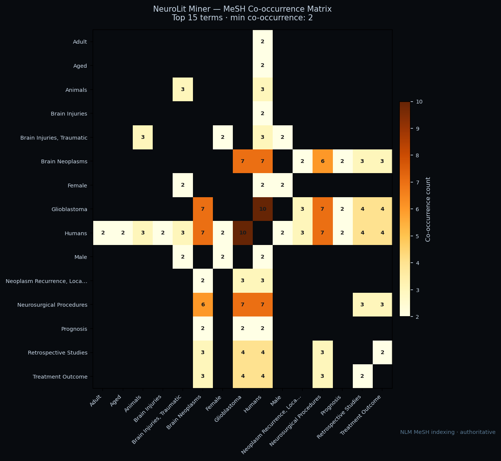

# NeuroLit Miner



**Automated neurosurgical literature surveillance and evidence synthesis platform**

[](https://github.com/DrMoumenAI/neurolit-miner/releases)
[](https://python.org)
[](LICENSE)
[](https://sqlite.org)

---

## What Is NeuroLit Miner?

NeuroLit Miner is a modular Python research platform built for clinician-scientists, research fellows, and neurosurgical investigators who need structured, reproducible evidence infrastructure. It automates the organizational layer of evidence synthesis: retrieving literature from PubMed and clinical trials from ClinicalTrials.gov, classifying each article on three independent biomedical axes using NLM MeSH ontology, storing everything in a queryable local database, generating publication-quality analytics figures, and producing AI-assisted evidence summaries — all from the command line or a local web interface.

**It is not a PubMed search interface.**

A PubMed search returns a flat list of titles. NeuroLit Miner returns a structured, classified, analyzable evidence corpus — with semantic metadata, MeSH-grounded confidence scores, three-axis ontology tagging, and synthesis-ready outputs that explicitly disclose evidence quality. The difference is the difference between a keyword list and a searchable evidence database.

---

## Clinical Motivation

Neurosurgery is a field where evidence quality matters acutely. Operative decisions — extent of resection in glioblastoma, timing of aneurysm repair, approach selection for skull base tumors — are increasingly expected to be grounded in systematic evidence rather than individual experience or institutional tradition. The volume of neurosurgical literature is expanding rapidly: thousands of articles are indexed on PubMed annually, with AI and machine learning applications alone doubling between 2018 and 2023.

As publication volume grows, evidence organization — not evidence generation — becomes the primary bottleneck for clinician-scientists. A researcher preparing a systematic review or meta-analysis on a neurosurgical topic must currently:

1. Conduct repeated PubMed searches across multiple query formulations
2. Deduplicate results across search runs
3. Screen titles and abstracts for relevance
4. Classify each article by study design, clinical topic, and outcome domain
5. Extract structured data for pooled analysis
6. Map the literature landscape to identify gaps and research priorities

Steps 1–4 consume the majority of the time invested in a systematic review — before a single piece of evidence has been critically appraised. This is infrastructure work: necessary, reproducible, and increasingly automatable. NeuroLit Miner automates these steps, allowing the clinician-scientist to focus on the tasks that require expert judgment: bias assessment, clinical contextualization, and synthesis interpretation.

The platform is designed for a specific user: a physician-scientist or research fellow who understands the clinical domain and recognizes the need for structured, reproducible, ontology-grounded evidence organization. It is not a consumer tool, does not provide clinical recommendations, and does not attempt to replace systematic review methodology.

---

## Clinical Research Use Cases

**Evidence surveillance**
Track the evolution of a research area over time. Monitor publication volume by year, identify which journals are driving a field, and detect emerging topics via MeSH co-occurrence mapping. Useful for annual literature reviews, grant background sections, and identifying where a new study would contribute.

**Systematic review preparation**
Build a structured, classified evidence corpus before formal screening begins. Use the three-axis taxonomy to pre-stratify retrieved articles by clinical topic, methodology, and outcome domain. Export bibliography CSV directly compatible with reference managers (Zotero, Mendeley, EndNote). The search log provides a reproducible record of every query for the PRISMA methods section.

**Meta-analysis planning**
Identify the methodological composition of a literature before committing to a meta-analysis protocol. The `method_tags` axis quantifies how many articles are retrospective cohorts, RCTs, or systematic reviews. MeSH confidence scoring identifies which articles are NLM-confirmed versus keyword-approximated — a direct input to inclusion/exclusion decisions.

**Research gap identification**
The MeSH co-occurrence matrix reveals which combinations of clinical topic, methodology, and outcome domain are well-represented and which are sparse. A high-frequency topic with low `randomized_trial` method representation signals a gap suitable for a prospective study proposal. The AI-assisted synthesis layer explicitly extracts stated limitations and future directions from stored abstracts.

**Trial-to-literature alignment**
Cross-reference published literature with active ClinicalTrials.gov trials in the same disease area. Identify whether an observed literature gap has a corresponding active trial, or whether published evidence has not yet been translated into trial design.

---

## Why It Exists

The neurosurgical literature is too large and too structurally heterogeneous to organize manually at scale. A single systematic review query may return hundreds of articles spanning retrospective case series, phase III trials, prognostic AI models, and quality-of-life studies — all valid, but representing fundamentally different levels and types of evidence. Organizing this material into a coherent, queryable corpus currently requires hours of manual work per search cycle.

NeuroLit Miner automates this organizational infrastructure, replacing manual classification with ontology-grounded taxonomy, keyword searches with MeSH-anchored semantic classification, and scattered spreadsheets with a structured, reproducible SQLite database.

| Manual workflow | NeuroLit Miner |
|-----------------|----------------|
| PubMed keyword search | Programmatic NCBI E-utilities query with PMID deduplication |
| Copy titles to spreadsheet | Structured SQLite storage with automatic MeSH-based classification |
| Reading each abstract to judge study design | Three-axis taxonomy: Clinical Topic · Methodology · Domain |
| Manual charts in Excel | Publication-quality PNG figures with trend analysis and co-occurrence mapping |
| Writing evidence summaries | AI-assisted synthesis with corpus quality disclosure and inline PMID citations |

---

## Why the Taxonomy Matters

The previous flat keyword taxonomy tagged 74% of articles as `outcomes_research` — a bucket so broad it was analytically useless.

The V3.1 three-axis taxonomy gives each article a structured fingerprint:

```
Article: "Machine learning for glioblastoma survival prediction: a multicenter study"

→ clinical_topic : glioblastoma       [HIGH confidence — NLM MeSH confirmed]
→ method         : ML_AI              [HIGH confidence — NLM MeSH: Machine Learning]
→ domain         : oncologic_outcomes [HIGH confidence — NLM MeSH: Survival Analysis]
→ topic_confidence : HIGH
```

This enables precise corpus construction before synthesis begins:

```bash
# HIGH-confidence glioblastoma outcomes corpus only
python src/summarize.py \
  --clinical_topic glioblastoma \
  --domain oncologic_outcomes \
  --min_confidence HIGH
```

The synthesizer receives a coherent, ontology-validated corpus — not a heterogeneous keyword bucket.

---

## Why Provider-Agnostic Architecture?

Evidence synthesis infrastructure should not be locked to a paid API. NeuroLit Miner:
- Works completely offline in mock mode (no API key, no cost, no internet required)
- Runs free local LLMs via [Ollama](https://ollama.ai)
- Supports Anthropic, OpenAI, and OpenRouter with a single flag
- Never crashes if an LLM backend is unavailable — falls back to mock automatically
- Adding a new provider requires changing **one file** and **one line**

---

## Key Features

### Retrieval
- Live PubMed queries via NCBI E-utilities (`esearch` + `efetch`)
- ClinicalTrials.gov integration via API v2 — trials stored alongside literature
- Automatic PMID deduplication and search logging for reproducibility

### Classification (V3.1)
- **Three-axis taxonomy:** Clinical Topic (14 categories) · Methodology (9) · Domain (10)
- **MeSH-first:** NLM-assigned subject headings take priority over keyword matching
- **Confidence scoring:** HIGH (MeSH-confirmed) · MEDIUM (title) · LOW (abstract) · UNVERIFIED
- **Backfill:** re-tag existing articles after taxonomy updates — non-destructive

### Analytics (V2)
- Publication trend by year with linear regression trend line
- Journal distribution — identify core venues in a field
- MeSH term frequency — authoritative semantic landscape
- MeSH co-occurrence matrix — structural map of research clustering

### Synthesis (V3)
- Mock mode: deterministic keyword-frequency analysis — zero setup, always works
- LLM mode: mock · Ollama · Anthropic · OpenAI · OpenRouter (single `--provider` flag)
- Corpus taxonomy profile in every output — evidence quality disclosed before synthesis
- Unique timestamped filenames with filter slugs — no output overwriting

### Web Interface (V1.5)
- Local Flask UI at `localhost:5000`
- Four tabs: PubMed Search · Local Database · Analytics · Clinical Trials
- Article cards with MeSH amber tags, topic tags, confidence indicators, DOI links

---

## Screenshots

| PubMed Search + MeSH Tags | MeSH Co-occurrence Matrix |
|--------------------------|--------------------------|
|  |  |

---

## Installation

```bash
git clone https://github.com/DrMoumenAI/neurolit-miner.git
cd neurolit-miner
pip install -r requirements.txt
```

**Requirements:** Python 3.10+, Flask, requests, matplotlib, numpy.
All other modules (sqlite3, xml.etree, csv, argparse, collections) are Python standard library.

---

## Quick Start

### Web interface
```bash
python run_app.py
# Open http://localhost:5000
```

### CLI — PubMed search and storage
```bash
python src/main.py --query "glioblastoma machine learning" --max 50
python src/main.py --query "AI neurosurgery" --max 100 --year_from 2020 --export
python src/main.py --search_db --topic glioblastoma --year_from 2021
```

### CLI — Tag existing articles with V3.1 taxonomy
```bash
python src/main.py --backfill_taxonomy     # tag UNVERIFIED articles
python src/main.py --force_backfill        # re-tag all articles
```

### CLI — Analytics figures
```bash
python src/analyze.py                      # all 5 figure types
python src/analyze.py --analysis mesh      # MeSH frequency only
python src/analyze.py --analysis cooccurrence --top_n 20
python src/analyze.py --analysis trend --clinical_topic glioblastoma --year_from 2019
```

### CLI — Evidence synthesis
```bash
# No setup required (mock mode)
python src/summarize.py --clinical_topic glioblastoma

# HIGH-confidence corpus only (MeSH-confirmed articles)
python src/summarize.py --clinical_topic glioblastoma --min_confidence HIGH

# Combined axis filter
python src/summarize.py \
  --clinical_topic glioblastoma \
  --domain surgical_outcomes \
  --year_from 2020

# Free local LLM (requires Ollama + ollama pull llama3)
python src/summarize.py --clinical_topic trauma --provider ollama

# Discover what's in your database
python src/summarize.py --list_taxonomy
python src/summarize.py --list_providers
```

---

## Project Structure

```
neurolit-miner/
│
├── src/
│   ├── pubmed_api.py    PubMed retrieval — NCBI E-utilities
│   ├── trials_api.py    ClinicalTrials.gov API v2
│   ├── parser.py        XML parsing + V3.1 three-axis taxonomy
│   ├── database.py      SQLite storage + migration + backfill
│   ├── exporter.py      CSV export utilities
│   ├── main.py          CLI entry point
│   ├── app.py           Flask server + REST API
│   ├── analyze.py       V2 analytics layer (5 figure types)
│   ├── summarizer.py    V3 provider abstraction layer
│   └── summarize.py     V3.1 synthesis CLI
│
├── templates/
│   └── index.html       Flask web UI (4 tabs)
│
├── docs/
│   ├── architecture.md  System architecture documentation
│   ├── taxonomy.md      Three-axis taxonomy specification
│   ├── roadmap.md       Version history and planned features
│   └── screenshots/     UI and output screenshots
│
├── data/                SQLite database (gitignored)
├── results/             Analytics figures and synthesis outputs (gitignored)
│
├── run_app.py           Convenience launcher
├── requirements.txt
├── README.md
├── ROADMAP_V3.md        Detailed V3+ module interaction map
└── .gitignore
```

---

## Architecture Overview

```
PubMed API              ClinicalTrials.gov API
      │                          │
 pubmed_api.py            trials_api.py
      │                          │
 parser.py  ←── MeSH + three-axis taxonomy (V3.1)
      │
 database.py (SQLite)
      ├── analyze.py  ──→  PNG + CSV figures
      └── summarize.py
           └── summarizer.py
               ├── mock (default — zero setup)
               ├── ollama (free, local)
               ├── anthropic
               ├── openai
               └── openrouter
```

Full documentation: [`docs/architecture.md`](docs/architecture.md)  
Taxonomy specification: [`docs/taxonomy.md`](docs/taxonomy.md)  
Roadmap: [`docs/roadmap.md`](docs/roadmap.md)

---

## Synthesis Output Structure

Every synthesis run produces three files in `results/`:

```
neurolit_summary_20260531_225719_clinical-glioblastoma_conf-high.md
neurolit_summary_20260531_225719_clinical-glioblastoma_conf-high.txt
neurolit_sources_20260531_225719_clinical-glioblastoma_conf-high.csv
```

Each report contains:
1. **Corpus taxonomy profile** — clinical topic, method, and domain distributions; confidence breakdown
2. **Current State of the Field**
3. **Dominant Methodologies**
4. **Key Findings** (with PMID inline citations)
5. **Research Gaps**

Every report includes a disclaimer clearly stating it is an AI-assisted narrative synthesis, not a systematic review.

---

## Workflow Notes

- The web UI requires Flask at `http://localhost:5000` — do not open `templates/index.html` directly as a `file://` URL
- The SQLite database at `data/neurolit.db` is the single source of truth
- PubMed searches append to the database — existing articles are never overwritten
- MeSH terms may be absent for articles published within the past 2–8 weeks (NLM indexing lag)
- Run `--backfill_taxonomy` after upgrading to V3.1 to tag existing articles

---

## Limitations

- Topic classification is ontology-based, not validated by systematic review librarians
- This tool does not replace full-text screening, risk-of-bias assessment, or PRISMA methodology
- Synthesis outputs are AI-assisted narrative summaries clearly labeled as such — not systematic reviews
- `global_neurosurgery` clinical topic has no MeSH anchor — keyword-based classification only (MEDIUM/LOW confidence)
- Flask development server is not production-hardened — local use only
- Cross-referencing between articles and trials tables is planned (V5.1) but not yet implemented

---

## Roadmap

| Version | Status | Key Feature |
|---------|--------|-------------|
| V1 | ✅ Done | PubMed pipeline, SQLite, CSV export, CLI |
| V1.5 | ✅ Done | ClinicalTrials.gov, MeSH extraction, Flask UI |
| V2 | ✅ Done | Analytics layer — 5 publication-quality figure types |
| V3 | ✅ Done | Provider-agnostic synthesis — mock/Ollama/Anthropic/OpenAI/OpenRouter |
| V3.1 | ✅ Done | Three-axis taxonomy, MeSH-first confidence scoring, taxonomy-aware synthesis |
| V3.2 | 🔄 Planned | Flask UI three-axis filters, corpus purity display |
| V4 | 🔄 Planned | PICO extraction module |
| V5 | 🔄 Planned | Evidence grading (Level I–V classification) |
| V6 | 🔄 Planned | RIS/BibTeX export, PRISMA flow diagram |

Full roadmap: [`docs/roadmap.md`](docs/roadmap.md)

---

## Citation

```
Moumen AM. NeuroLit Miner: Automated neurosurgical literature surveillance
and evidence synthesis platform. GitHub, 2026.
https://github.com/DrMoumenAI/neurolit-miner
```

---

## Author

**Assia M. Moumen, M.D., MEng**  
Researcher focused on building computational tools for neurosurgical evidence synthesis, global neurosurgery intelligence, and AI-assisted clinical research infrastructure.

---

> *NeuroLit Miner is a research infrastructure prototype. It is not a validated clinical decision support tool and does not provide medical advice.*
